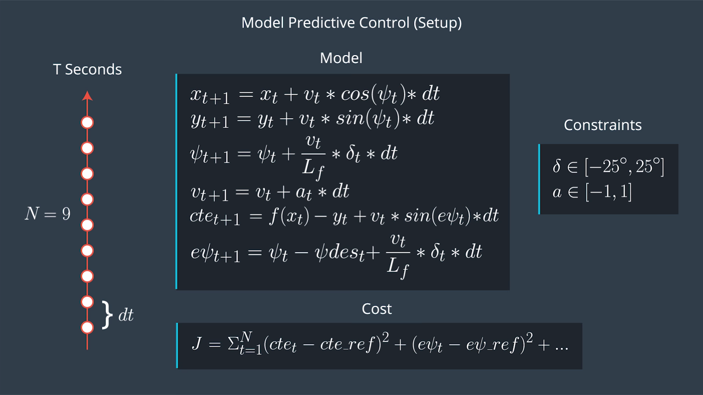
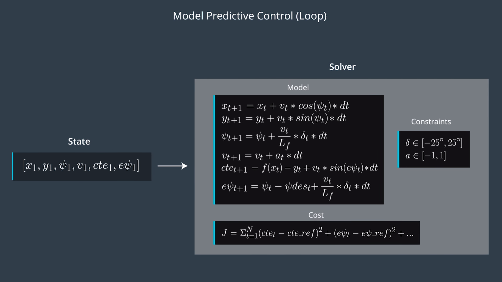
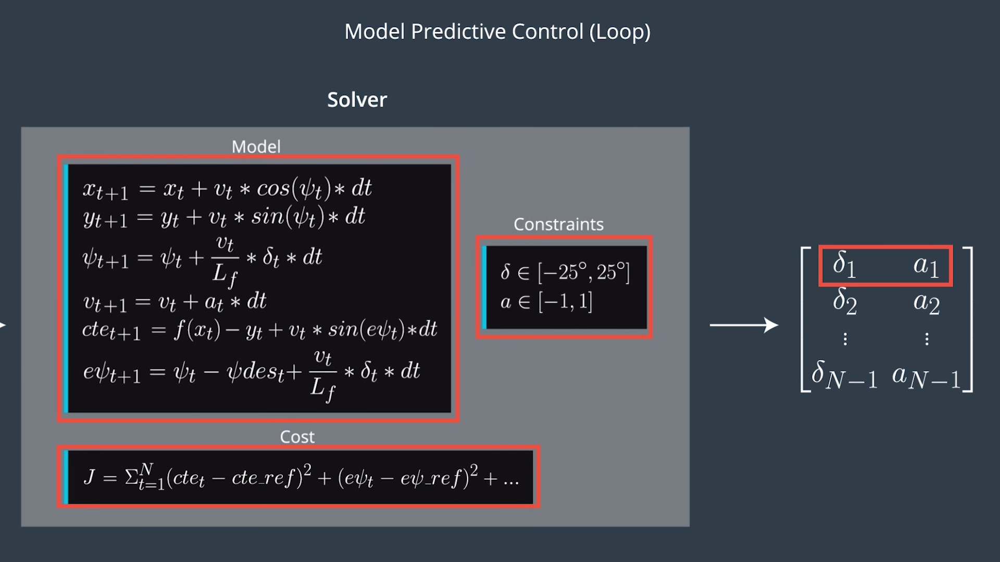

# Model Predictive Control
---
[](http://www.udacity.com/drive)

In this project we would implement a Model Predictive Controller to follow a desired trajectory around a test track in Udacity's simulator.

---

## Dependencies

* cmake >= 3.5
 * All OSes: [click here for installation instructions](https://cmake.org/install/)
* make >= 4.1
  * Linux: make is installed by default on most Linux distros
  * Mac: [install Xcode command line tools to get make](https://developer.apple.com/xcode/features/)
  * Windows: [Click here for installation instructions](http://gnuwin32.sourceforge.net/packages/make.htm)
* gcc/g++ >= 5.4
  * Linux: gcc / g++ is installed by default on most Linux distros
  * Mac: same deal as make - [install Xcode command line tools]((https://developer.apple.com/xcode/features/)
  * Windows: recommend using [MinGW](http://www.mingw.org/)
* [uWebSockets](https://github.com/uWebSockets/uWebSockets)
  * Run either `install-mac.sh` or `install-ubuntu.sh`.
  * If you install from source, checkout to commit `e94b6e1`, i.e.
    ```
    git clone https://github.com/uWebSockets/uWebSockets 
    cd uWebSockets
    git checkout e94b6e1
    ```
    Some function signatures have changed in v0.14.x. See [this PR](https://github.com/udacity/CarND-MPC-Project/pull/3) for more details.
* Fortran Compiler
  * Mac: `brew install gcc` (might not be required)
  * Linux: `sudo apt-get install gfortran`. Additionall you have also have to install gcc and g++, `sudo apt-get install gcc g++`. Look in [this Dockerfile](https://github.com/udacity/CarND-MPC-Quizzes/blob/master/Dockerfile) for more info.
* [Ipopt](https://projects.coin-or.org/Ipopt)
  * Mac: `brew install ipopt`
  * Linux
    * You will need a version of Ipopt 3.12.1 or higher. The version available through `apt-get` is 3.11.x. If you can get that version to work great but if not there's a script `install_ipopt.sh` that will install Ipopt. You just need to download the source from the Ipopt [releases page](https://www.coin-or.org/download/source/Ipopt/) or the [Github releases](https://github.com/coin-or/Ipopt/releases) page.
    * Then call `install_ipopt.sh` with the source directory as the first argument, ex: `sudo bash install_ipopt.sh Ipopt-3.12.1`. 
  * Windows: If you can use the Linux subsystem and follow the Linux instructions.
* [CppAD](https://www.coin-or.org/CppAD/)
  * Mac: `brew install cppad`
  * Linux `sudo apt-get install cppad` or equivalent.
  * Windows: TODO. If you can use the Linux subsystem and follow the Linux instructions.
* [Eigen](http://eigen.tuxfamily.org/index.php?title=Main_Page). This is already part of the repo so you shouldn't have to worry about it.
* Simulator. You can download these from the [releases tab](https://github.com/udacity/self-driving-car-sim/releases).
* Not a dependency but read the [DATA.md](./DATA.md) for a description of the data sent back from the simulator.


## Basic Build Instructions

1. Clone this repo.
2. Make a build directory: `mkdir build && cd build`
3. Compile: `cmake .. && make`
4. Run it: `./mpc`.


## Implementation


**The Model.**

* The Model Predictive Control is a nonlinear optimal controller that uses a kinematic model of the vehicle's motion in a Unity simulator. The state comprises of `x` and `y` coordinates of the vehicle, orientation of the vehicle - `psi`, velocity of the vehicle - `v`, cross track error between desired and actual trajectory - `cte` and heading error - `epsi`. The control inputs are the steering angle - `delta` and throttle - `a`. The kinematic model is shown in the graphic alongwith the constraints on control inputs. 

<p></p> 
<figure>
 
 <figcaption>
 <p></p> 
 <p style="text-align: center;"> Kinematic Equations </p> 
 </figcaption>
</figure>
<p></p>

* The above graphic also hints at the functioning of the MPC controller. The future time horizon is divided into `N` time steps with a duration of `dt` between them. The desired trajectory in the form of waypoints is given to the controller along with the current state. The cross track error and orienation error is computed. A cost function is generated which takes into account the costs incurred due to cross track error error, orienation error,  and velocity error. In addition, to ensure that actual inputs are smoother for better stability of the controller additional costs due to magnitudes, slopes and curvature of steering angle and throttle are added to the cost function. Then the constraints on the actuator inputs (control inputs) are added and the nonlinear optimization problem is solved as illustrated in these graphics: 

<figure>
 
 <figcaption>
 <p></p> 
 <p style="text-align: center;"> Solver </p> 
 </figcaption>
</figure>
<p></p>
<figure>
 
 <figcaption>
 <p></p> 
 <p style="text-align: center;"> Output </p> 
 </figcaption>
</figure>
<p></p>

* The Ipopt solver gives optimal actuator inputs over the receding horizon of N timesteps. The controller executes the first step and resolves the same problem at the next iteration. This is done to ensure that controller is robust to scene changes on the road. The waypoints predicted by the controller are shown in green in the simulator while the actual waypoints are shown in yellow. 


**Timestep Length and Elapsed Duration (N & dt).**

* `N` was chosen as `10` and `dt` was set to `0.05` seconds to give a total time horizon spanning over `0.5` seconds. `N` has a heavy toll on performance of the solver so it was not increased, a smaller value of `5` was tried but led to worse performance as there were too few waypoints to accurately set the associated costs. The duration `dt` was set as `0.1` initially but led to the car cutting some corners on turns as there were not enough predicted waypoints to negotiate turns smoothly, so a value of `0.05`seconds was chosen which better approximated the the desired trajectory at turns. 


**Polynomial Fitting and MPC Preprocessing.**

* A cubic polynomial was fitted to the desired waypoints which were first transformed to the vehicle frame to make subsequent calculations easier - the `x`, `y` and `psi` states are always zero in this coordinate frame. The orienation errors were calculated by calculating the difference between the slopes of desired polynomial curve and current orienation. The cross track error was computed similarly. An adaptive reference velocity was set to incorporate braking at the turns since it's an expected human behavior to brake at a turn. This is achieved by penalizing cross track error and orientation error when calculating desired velocity.


**Model Predictive Control with Latency.**

* In real-world situations there is a certain lag between the time when the solver outputs a solution and the actuators actually execute it. This is approximated to be 100 ms in this model and is handled by calculating the position and velocity of the vehicle in the global coordinate frame after this delay. This information is then utilized to calculate the new coordinates of desired waypoints in the vehicle frame which has moved globally. The rest of the procedure is similar except that the desired velocity is decreased from 120 to 100 miles per hour and the cost function coefficients are changed in comparision to the no-delay case.


**Videos.**

* [No Latency](https://youtu.be/uJQ-8ufyZcQ)
* [Latency](https://youtu.be/_6eAb73Vis8)
